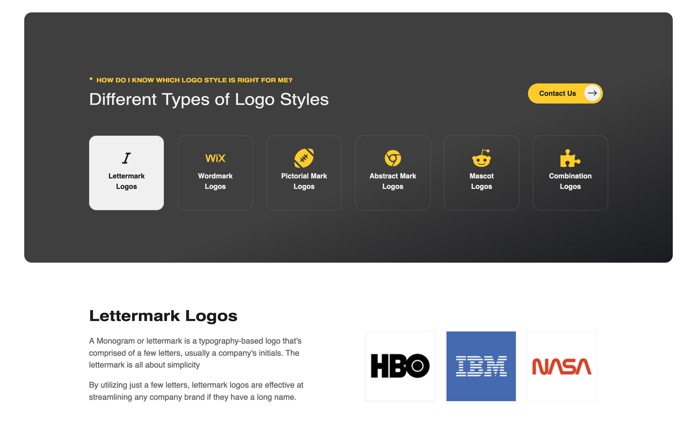
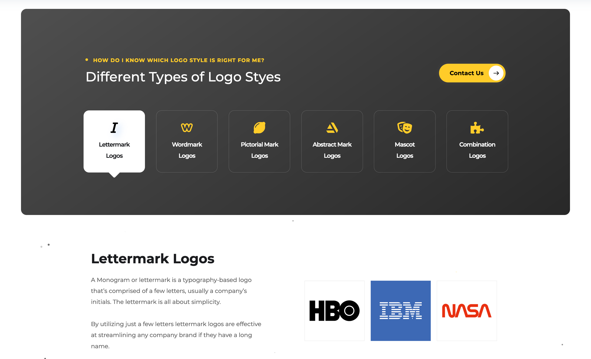

## This repo is a technical challenge assignment given to me by [Nytelock Digital](https://nytelock.com) for a chance at an internship.
- The task was to replicate their logo services section from the website using React, CSS, etc.
- The [production link](https://nytelock-logos.vercel.app) in this repo is the final product of my attempt.
- This product is NOT mobile responsive. The task was meant as a desktop view challenge and I was asked not to make it responsive so as the assignment submissions can be a bit faster.
- I was not given any resources to complete this -- just the original website view. Their content is even protected, so I could not access the fonts. Because of this, there are some minute differences in font size and font family between my product and theirs.  

## My product  

 
 
## Nytelock's original product  

